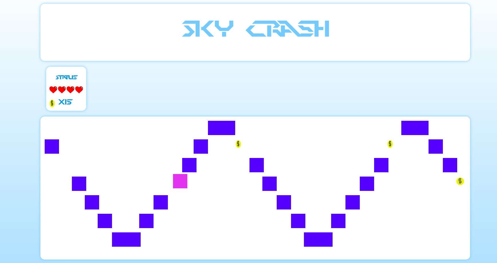

  
 <h1 align = "center"> Welcome to SKYCRASH !!!!</h1>

Arcade 2d videogame with collisions,sprites, random wave generator and much more. Everything implemented using only javascript and no libraries!! :grin: :grin:

  

  
  

  
  
  
